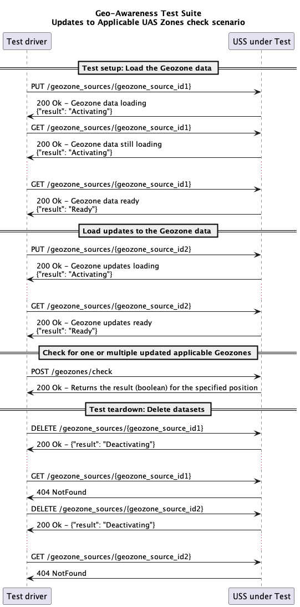

# Geo-Awareness Test Suite

This folder contains the Geo-Awareness test suite description,
the [interface for Geo-Awareness automated testing](geo-awareness.yaml) and
the [design of Geo-Awareness automated testing](design) documentation.

## Overview

This test suite is based on the following scenario:
> If I (the test director, acting like a normal client operator) were to request information at this specific point, would you (the USSP under test) indicate that there are any applicable operational conditions or airspace constraints, relevant UAS geographical zones, or applicable temporary restrictions.

It has been designed to not impose additional requirements to USSP
implementation. [See discussion for details](https://github.com/interuss/dss/pull/809#discussion_r982930704)

A USSP wishing to qualify its service using this test suite must implement
the [interface for Geo-Awareness automated testing](geo-awareness.yaml).

## Scope

This test suite covers the Geo-Awareness service as required by the U-Space
regulation ([COMMISSION IMPLEMENTING REGULATION (EU) 2021/664, Article 9](https://eur-lex.europa.eu/legal-content/EN/TXT/HTML/?uri=CELEX:32021R0664&from=EN#d1e1006-161-1))
and the related [AMC/GM](https://www.easa.europa.eu/en/downloads/134303/en).

The following sections outline the requirements checked by this test suite.

### [AMC1 Article 5(1) Common information services](https://www.easa.europa.eu/en/downloads/134303/en)

It specifies that the "format of airspace information, including geographical zones, static and dynamic airspace
restrictions, adjacent U-space airspace, and the horizontal and vertical limits of the U-space airspace should be as
described in Chapter VIII ‘UAS geographical zone data model’ of and Appendix 2 to the ED-269 ‘MINIMUM OPERATIONAL
PERFORMANCE STANDARD FOR GEOFENCING’ standard in the version published in June 2020."

ED-269 do not provide systematic references to requirements. For the purpose of traceability, requirements of this test
suite are identified with the following IDs. 

| Requirement ID | Type           | Requirement                                                                   |
|----------------|----------------|-------------------------------------------------------------------------------|
| ED-269-100*    | Data ingestion | USSP shall be able to load the test dataset                                   |
| ED-269-101*    | Data ingestion | USSP shall reject invalid dataset                                             |
| ED-269-102*    | Data ingestion | USSP shall correctly handle updates to the dataset                            |
| ED-269-201*    | Data format    | USSP shall correctly interpret restriction code `PROHIBITED`                    |
| ED-269-202*    | Data format    | USSP shall correctly interpret restriction code `REQ_AUTHORISATION`             |
| ED-269-203*    | Data format    | USSP shall correctly interpret restriction code `CONDITIONAL`                   |
| ED-269-204*    | Data format    | USSP shall correctly interpret restriction code `NO_RESTRICTION`                |
| ED-269-210*    | Data format    | USSP shall correctly interpret U-Space class `OPEN`                             |
| ED-269-211*    | Data format    | USSP shall correctly interpret U-Space class `SPECIFIC`                         |
| ED-269-212*    | Data format    | USSP shall correctly interpret U-Space class `CERTIFIED`                        |
| ED-269-220*    | Data format    | USSP shall correctly interpret AGL references                                 |
| ED-269-221*    | Data format    | USSP shall correctly interpret AMSL references                                |
| ED-269-230*    | Data format    | USSP shall correctly interpret AirspaceVolume defined with Polygons           |
| ED-269-231*    | Data format    | USSP shall correctly interpret AirspaceVolume defined with Polygons with holes |
| ED-269-235*    | Data format    | USSP shall correctly interpret AirspaceVolume defined with Circle             |
| ED-269-236*    | Data format    | USSP shall correctly interpret AirspaceVolume defined with Circles            |
| ED-269-237*    | Data format    | USSP shall correctly interpret overlapping AirspaceVolumes                    |
| ED-269-280*    | Data format    | USSP shall correctly interpret time restrictions defined with TimePeriod      |
| ED-269-281*    | Data format    | USSP shall correctly interpret daily restrictions defined with DailyPeriod    |

* ED-269 unmapped requirements

### [GM1 Article 9 Geo-awareness service (c)](https://www.easa.europa.eu/en/downloads/134303/en)

It specifies that the "Geo-Awareness service is used by the UAS flight authorisation service as a source of data to
inform UAS operators of relevant operational constraints and changes both prior to and during the flight."

1. **"... both prior to and during the flight"** *requirement is fulfilled by ED-269-102 described above.*

## Test scenarios

This test suite is composed of the following scenarios:

1. Applicable UAS Zones
2. Updates to Applicable UAS Zones

### Required resources

- Geo-Awareness test provider
- Geo-Awareness test dataset
- USSP under test implementing the [test interface](geo-awareness.yaml)

### Test scenario 1: Applicable UAS Zones

#### Flow

#### Test cases and checks

1. Test setup: Load the GeoZones dataset

2. Simple checks: Test multiple position for a single GeoZone for a combination of:
    1. positions
        1. verticalReference AMSL
        2. verticalReference AGL

    2. restrictions:
        1. PROHIBITED
        2. REQ_AUTHORISATION
        3. CONDITIONAL
        4. NO_RESTRICTION

    3. USpaceClass:
        1. OPEN
        2. SPECIFIC
        3. CERTIFIED

    4. Airspace Volume
        1. Simple geometry
            1. polygons and circles, with/without holes, with zones of different shapes superimposed in height
        2. Edge-case geometry
            1. Mininum (200 m2) and maximum (1'000'000 km2) surface
            2. Concave shape with the sharpest angles as per ch.8

    5. Time applicability
        1. Time restrictions
        2. Daily restrictions

3. Overlapping and adjacent zone checks: Test multiple positions for multiple GeoZones overlapping and adjacent on the
   following aspects:
    2. AirspaceVolume
    3. Restrictions
    4. USpaceClass
    5. Time Applicability

4. Test teardown: Delete the GeoZones dataset

#### Coverage

| Req ID     | Checked | Implemented by the test driver |
|------------|---------|--------------------------------|
| ED-269-100 | Y       |                                |
| ED-269-101 | Y       |                                |
| ED-269-102 | N       |                                |
| ED-269-201 | Y       |                                |
| ED-269-202 | Y       |                                |
| ED-269-203 | Y       |                                |
| ED-269-204 | Y       |                                |
| ED-269-210 | Y       |                                |
| ED-269-211 | Y       |                                |
| ED-269-212 | Y       |                                |
| ED-269-220 | Y       |                                |
| ED-269-221 | Y       |                                |
| ED-269-230 | Y       |                                |
| ED-269-231 | Y       |                                |
| ED-269-235 | Y       |                                |
| ED-269-236 | Y       |                                |
| ED-269-237 | Y       |                                |
| ED-269-280 | Y       |                                |
| ED-269-281 | Y       |                                |

### Test scenario 2: Updates to Applicable UAS Zones check

#### Flow

#### Test cases and checks

The test cases are similar to the Test scenario 1 but are run after an update to the GeoZones.

#### Coverage

This scenario focuses on checking ED-269-102 requirement.